# HR Schema - Entity Relationship Diagrams

This document contains various ER diagrams visualizing the Oracle HR schema relationships using Mermaid syntax.

> **Note:** These Mermaid diagrams will render interactively in GitHub, VS Code (with Mermaid extension), and other Markdown viewers that support Mermaid.

---

## Complete Schema Diagram

```mermaid
erDiagram
    REGIONS ||--o{ COUNTRIES : contains
    COUNTRIES ||--o{ LOCATIONS : "has offices in"
    LOCATIONS ||--o{ DEPARTMENTS : "houses"
    JOBS ||--o{ EMPLOYEES : "assigned to"
    DEPARTMENTS ||--o{ EMPLOYEES : "works in"
    DEPARTMENTS ||--o| EMPLOYEES : "managed by"
    EMPLOYEES ||--o{ EMPLOYEES : "reports to"
    EMPLOYEES ||--o{ JOB_HISTORY : "has history"
    JOBS ||--o{ JOB_HISTORY : "tracks"
    DEPARTMENTS ||--o{ JOB_HISTORY : "involved in"

    REGIONS {
        number region_id PK
        varchar region_name
    }
    
    COUNTRIES {
        char country_id PK "ISO 2-letter code"
        varchar country_name
        number region_id FK
    }
    
    LOCATIONS {
        number location_id PK "SEQ:3300+100"
        varchar street_address
        varchar postal_code
        varchar city "NOT NULL"
        varchar state_province
        char country_id FK
    }
    
    DEPARTMENTS {
        number department_id PK "SEQ:280+10"
        varchar department_name "NOT NULL"
        number manager_id FK "Circular with EMPLOYEES"
        number location_id FK
    }
    
    JOBS {
        varchar job_id PK
        varchar job_title "NOT NULL"
        number min_salary
        number max_salary
    }
    
    EMPLOYEES {
        number employee_id PK "SEQ:207+1"
        varchar first_name
        varchar last_name "NOT NULL"
        varchar email "UNIQUE, NOT NULL"
        varchar phone_number
        date hire_date "NOT NULL"
        varchar job_id FK "NOT NULL"
        number salary "CHECK > 0"
        number commission_pct
        number manager_id FK "Self-referencing"
        number department_id FK
    }
    
    JOB_HISTORY {
        number employee_id PK_FK "Composite PK"
        date start_date PK "Composite PK"
        date end_date "CHECK > start_date"
        varchar job_id FK
        number department_id FK
    }
```

---

## Geographic Hierarchy

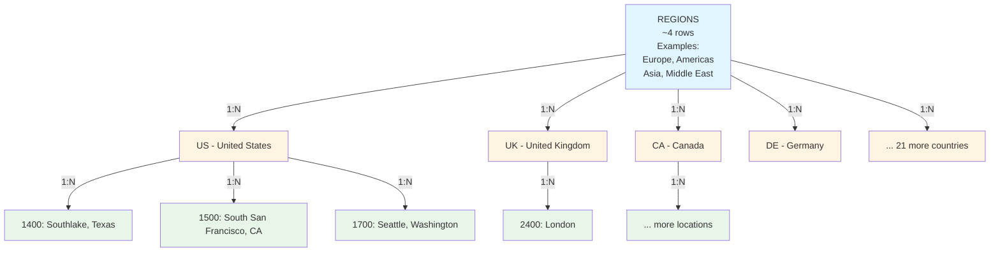

**Access Pattern:** `regions → countries → locations`  
**Use Case:** "Find all office locations in Europe"

---

## Organizational Hierarchy

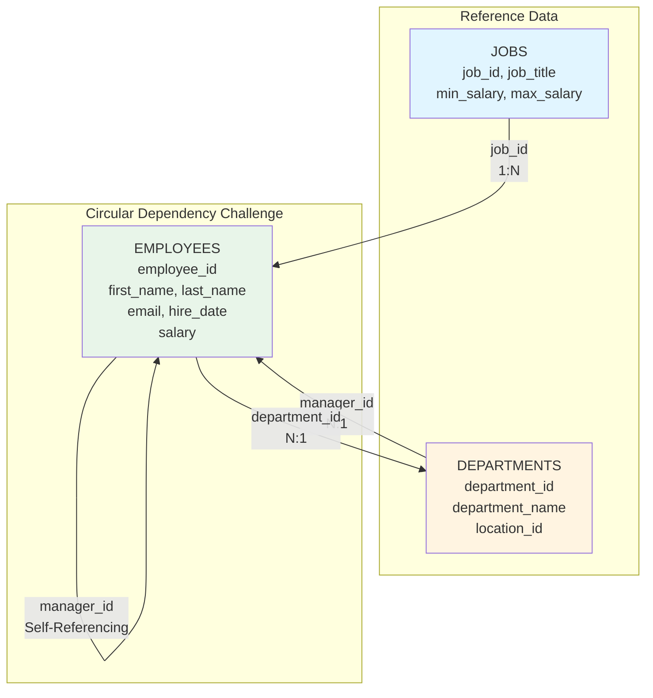

### Management Hierarchy Example

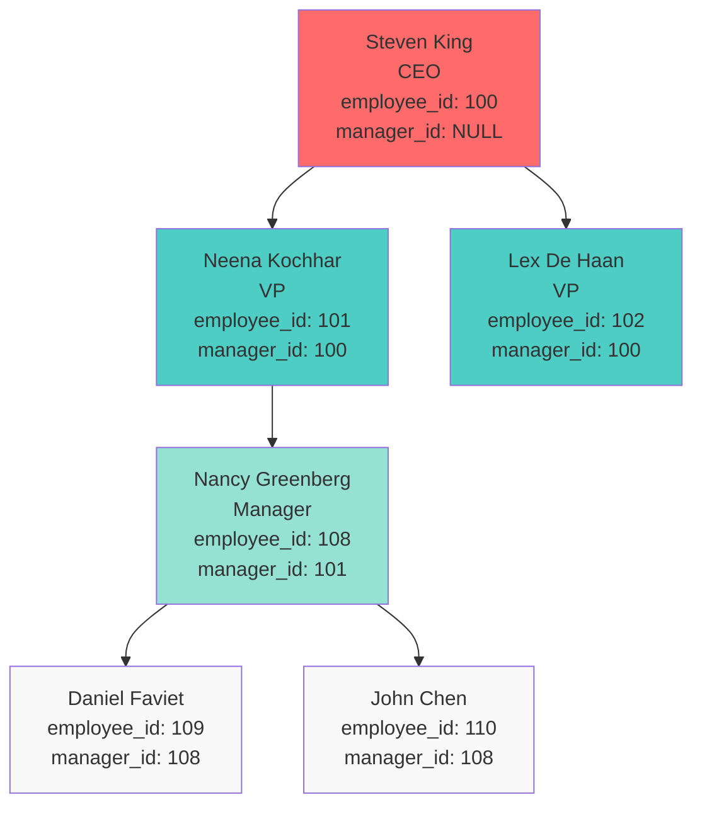

**⚠️ Circular Dependency Challenge:**
- `departments.manager_id` → `employees.employee_id`
- `employees.department_id` → `departments.department_id`

---

## Employee Detail Relationships

### Six-Way Join for Complete Employee Information

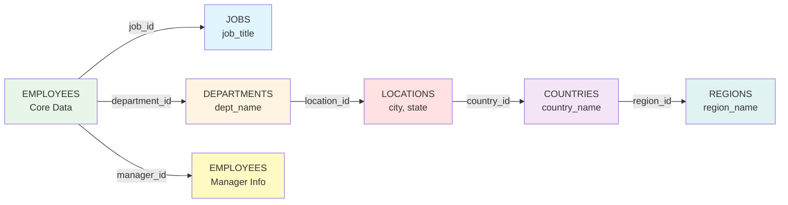

### SQL Query Pattern

```sql
SELECT 
    e.employee_id, 
    e.first_name, 
    e.last_name,
    e.email,
    e.hire_date,
    e.salary,
    j.job_title,                    -- JOIN 1: jobs
    d.department_name,              -- JOIN 2: departments
    l.city, 
    l.state_province,               -- JOIN 3: locations
    c.country_name,                 -- JOIN 4: countries
    r.region_name,                  -- JOIN 5: regions
    m.first_name || ' ' || 
    m.last_name as manager_name     -- JOIN 6: employees (self)
FROM employees e
JOIN jobs j ON e.job_id = j.job_id
JOIN departments d ON e.department_id = d.department_id
JOIN locations l ON d.location_id = l.location_id
JOIN countries c ON l.country_id = c.country_id
JOIN regions r ON c.region_id = r.region_id
LEFT JOIN employees m ON e.manager_id = m.employee_id
WHERE e.employee_id = ?
```

### CosmosDB Denormalized Document

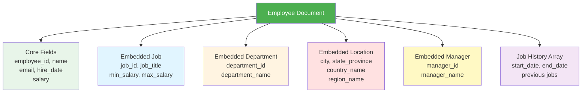

**💡 CosmosDB Implication:**  
Six-way join in relational model → **Single document read** in CosmosDB through denormalization

---

## Job History Tracking

### Oracle Trigger Mechanism

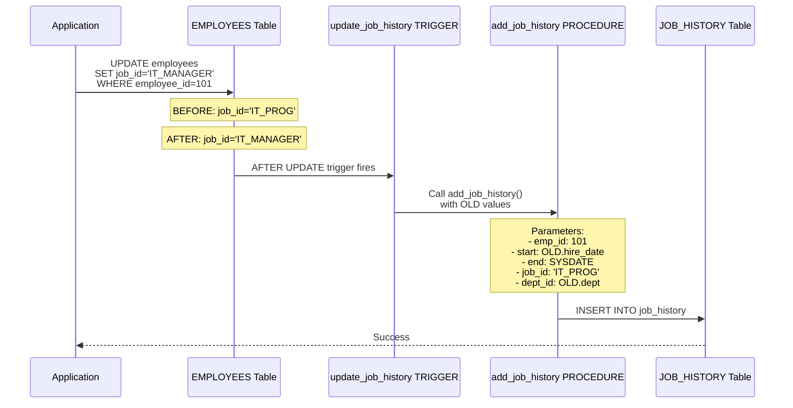

### Example Flow

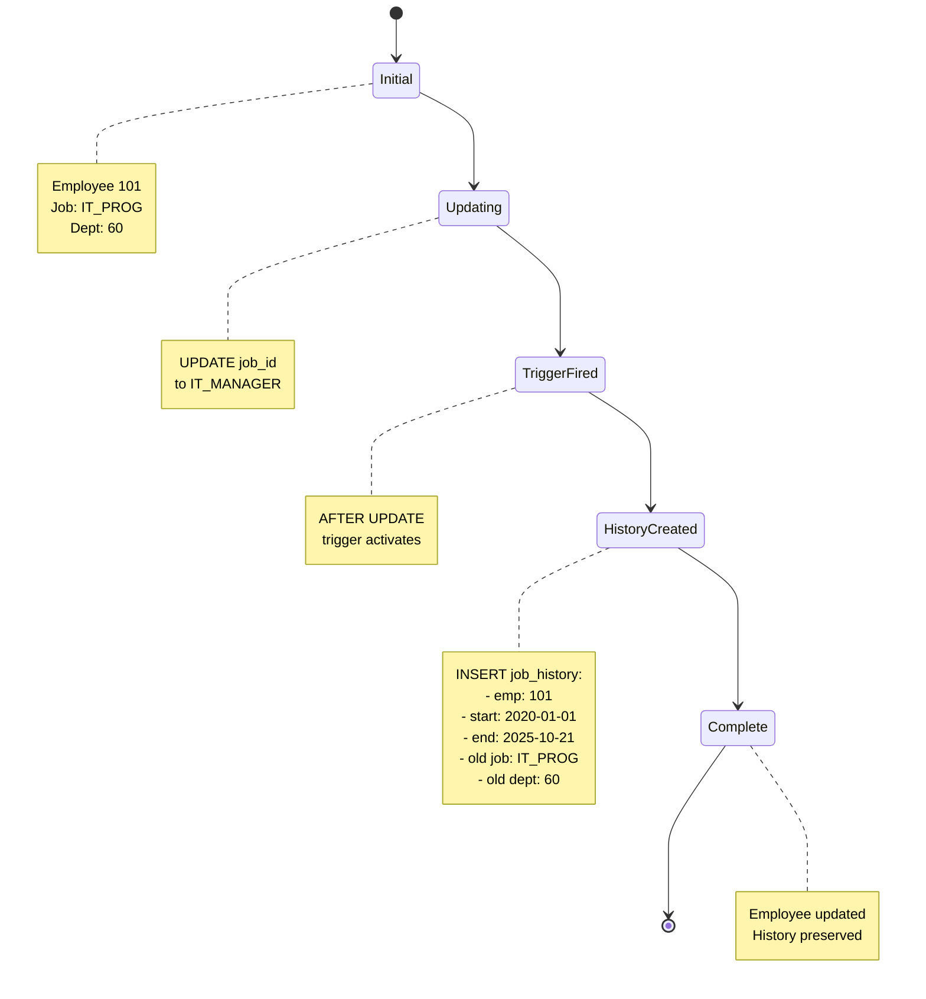

### CosmosDB Migration Solutions

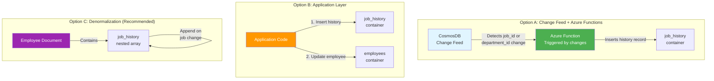

**⚠️ Migration Challenge:** CosmosDB doesn't have triggers that fire on UPDATE  
**✅ Recommended Solution:** Option C (Denormalization) or Option A (Change Feed)

---

## Partition Key Strategy for CosmosDB

### Option 1: Partition by department_id

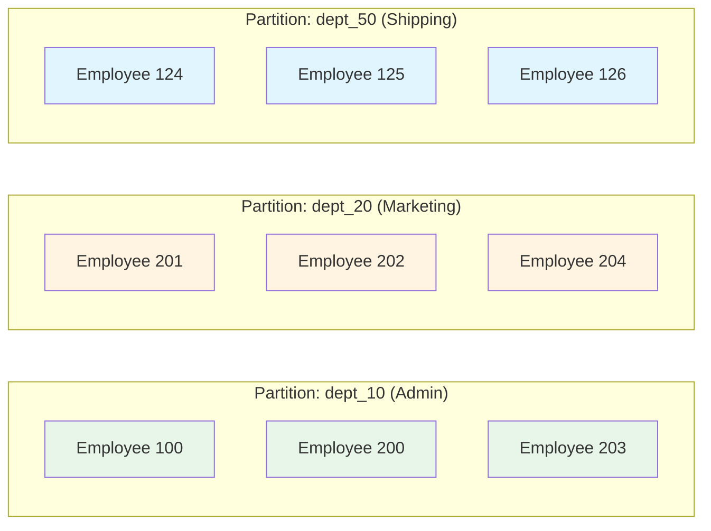

**Pros:**
- ✅ Efficient for "get all employees in department"
- ✅ Natural grouping
- ✅ Manager queries efficient (if manager in same dept)

**Cons:**
- ❌ Cross-partition query for manager hierarchy
- ❌ Uneven distribution (some depts larger than others)
- ❌ Hot partitions possible

---

### Option 2: Partition by employee_id

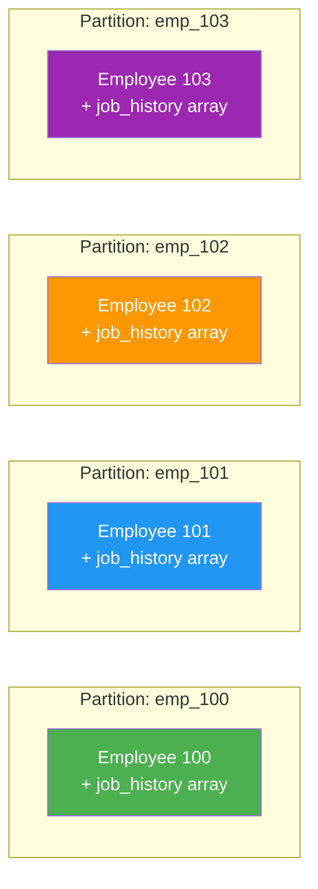

**Pros:**
- ✅ Perfect distribution
- ✅ Point reads super efficient
- ✅ Job history co-located with employee

**Cons:**
- ❌ All aggregation queries are cross-partition
- ❌ "List all employees" is expensive
- ❌ Department queries cross-partition

---

### Option 3: Synthetic Partition Key (Recommended)

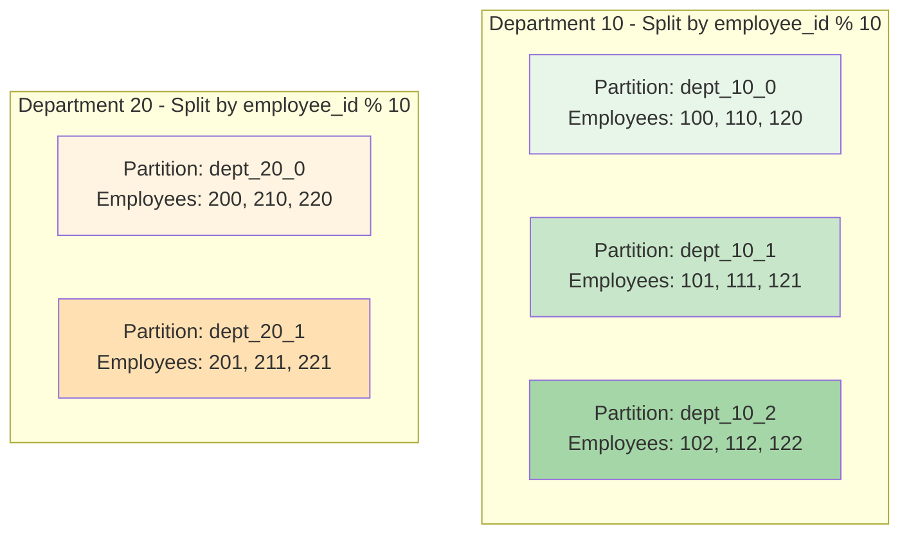

**Partition Key Formula:** `${department_id}_${employee_id % 10}`

**Pros:**
- ✅ Better distribution within departments
- ✅ Department queries hit multiple partitions (fan-out) but bounded
- ✅ Prevents hot partitions

**Cons:**
- ❌ More complex
- ❌ Requires calculation

---

### Reference Data Container Strategy

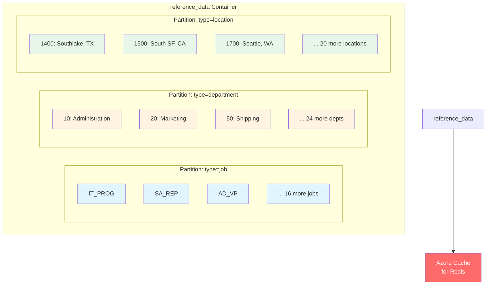

**Strategy:** Combine reference data container with Azure Cache for Redis for frequent lookups

---

## Migration Dependency Graph

### Migration Flow Diagram

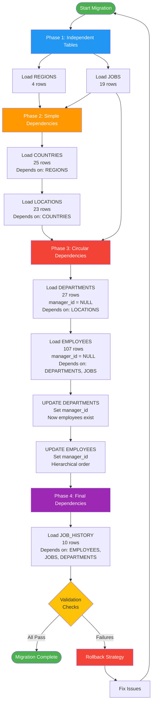

### Validation Checks

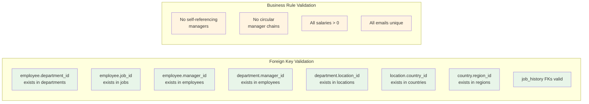

### CosmosDB Containers

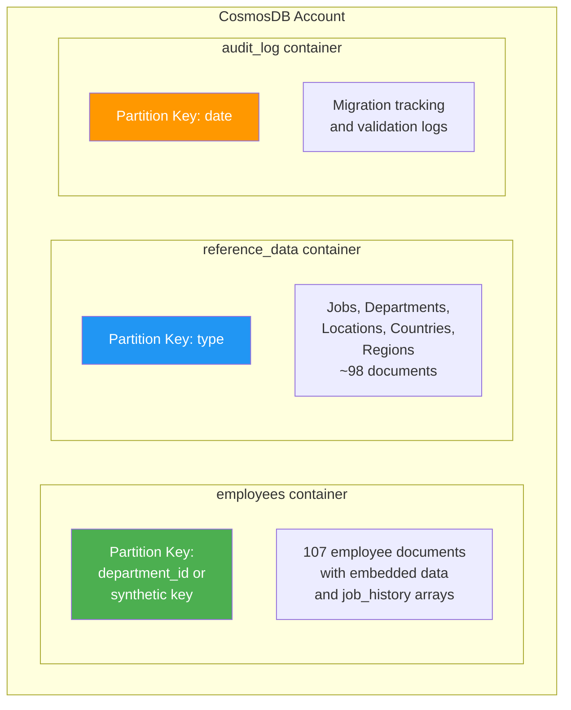

### Rollback Strategy

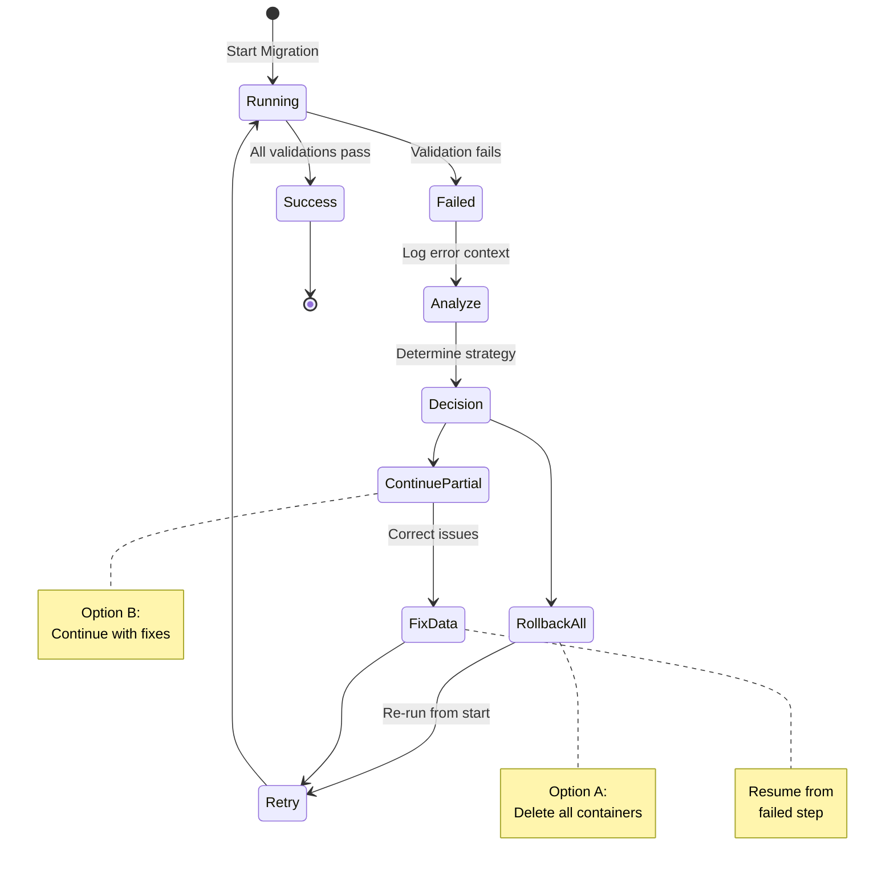

---

## Summary

This ER documentation provides interactive Mermaid diagrams for:

1. **Complete Schema Diagram** - Full view of all 7 tables and relationships (ERD format)
2. **Geographic Hierarchy** - Visual tree showing regions → countries → locations
3. **Organizational Hierarchy** - Departments, employees, jobs, and circular dependencies
4. **Management Hierarchy Example** - Actual employee reporting structure
5. **Employee Detail Relationships** - The 6-way join visualization
6. **CosmosDB Denormalized Document** - Recommended document structure
7. **Job History Tracking** - Oracle trigger mechanism and CosmosDB alternatives (sequence diagrams)
8. **Partition Key Strategies** - Three options with visual representation
9. **Migration Dependency Graph** - Step-by-step migration flow with validation
10. **Rollback Strategy** - Error handling state diagram

### Diagram Features

✨ **Interactive**: Mermaid diagrams render natively in:
- GitHub
- VS Code (with Mermaid extension)
- Azure DevOps
- Most modern Markdown viewers

🎨 **Color-coded**: Different colors for different entity types:
- 🟢 Green: Core employee data
- 🔵 Blue: Job/reference data
- 🟡 Yellow: Location/geographic data
- 🟣 Purple: Historical/audit data
- 🔴 Red: Critical migration phases

### Key Takeaways

- ⚠️ **Two circular dependencies** must be resolved with two-phase loading
- 🔄 **Self-referencing manager hierarchy** requires hierarchical or two-phase loading
- 📊 **Denormalization recommended** for CosmosDB to avoid 6-way joins
- 🎯 **Partition by department_id** or synthetic key for best performance
- 🔔 **Trigger logic** must be replicated via Change Feed + Azure Functions
- ✅ **4-phase migration** process with validation at each step

### How to View

```bash
# VS Code: Install Mermaid extension
# Extension ID: bierner.markdown-mermaid

# Or view on GitHub:
# Just push this file - Mermaid renders automatically!
```

---

**Document Version:** 2.0 (Updated with Mermaid diagrams)  
**Created:** October 21, 2025  
**Last Updated:** October 21, 2025  
**Status:** ✅ Complete with Interactive Diagrams
