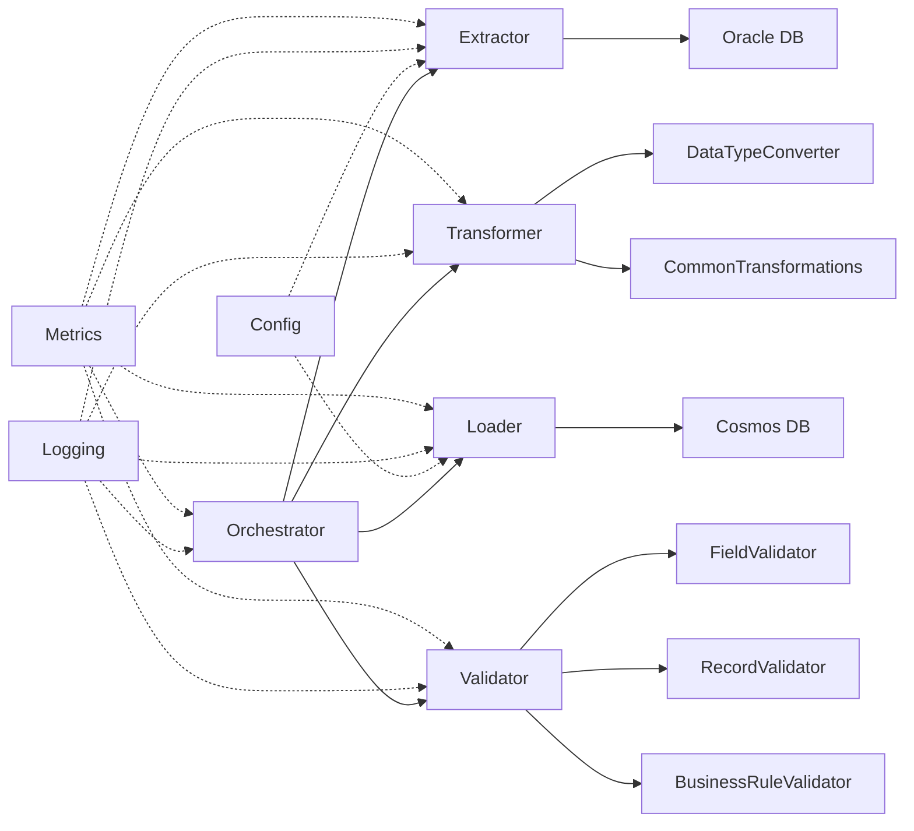

# Operations Guide

Complete guide for developing, extending, deploying, and operating the PySpark migration framework in production.

---

## Table of Contents

**Part 1: Development**
1. [Architecture Overview](#architecture-overview)
2. [Core Concepts](#core-concepts)
3. [Extending the Framework](#extending-the-framework)
4. [Code Organization](#code-organization)
5. [Development Best Practices](#development-best-practices)

**Part 2: Deployment & Operations**
6. [Pre-Deployment Checklist](#pre-deployment-checklist)
7. [Environment Setup](#environment-setup)
8. [Monitoring and Observability](#monitoring-and-observability)
9. [Performance Tuning](#performance-tuning)
10. [Scaling Strategies](#scaling-strategies)
11. [Backup and Rollback](#backup-and-rollback)
12. [Security Hardening](#security-hardening)
13. [Operational Procedures](#operational-procedures)
14. [Troubleshooting](#troubleshooting)

---

# Part 1: Development

## Architecture Overview

### Layered Architecture

The framework follows a layered architecture with clear separation of concerns:

```
┌─────────────────────────────────────────────┐
│         Orchestration Layer                 │
│  (migrate_reference_data.py,               │
│   migrate_employees.py,                    │
│   run_all_migrations.py)                   │
└─────────────────────────────────────────────┘
                    ↓
┌─────────────────────────────────────────────┐
│         Processing Layer                    │
│  ┌──────────┐ ┌──────────┐ ┌──────────┐   │
│  │Extractor │→│Transformer│→│Validator │   │
│  └──────────┘ └──────────┘ └──────────┘   │
└─────────────────────────────────────────────┘
                    ↓
┌─────────────────────────────────────────────┐
│         Data Layer                          │
│  ┌──────────┐              ┌──────────┐    │
│  │ Oracle   │──────────────→│ Cosmos   │    │
│  │   DB     │  (via Loader) │   DB     │    │
│  └──────────┘              └──────────┘    │
└─────────────────────────────────────────────┘
                    ↓
┌─────────────────────────────────────────────┐
│         Foundation Layer                    │
│  (Config, Utils, Logging, Metrics)         │
└─────────────────────────────────────────────┘
```

### Component Interactions



---

## Core Concepts

### Template Method Pattern

All base classes use the Template Method pattern for consistent behavior:

```python
class BaseTransformer(ABC):
    """Base class for transformers."""
    
    def transform_with_metrics(self, *args, **kwargs):
        """Template method with metrics tracking."""
        self.metrics.start()
        
        try:
            # Validate inputs
            self.validate_input(*args, **kwargs)
            
            # Perform transformation (implemented by subclass)
            result = self.transform(*args, **kwargs)
            
            # Track success
            self.metrics.increment("records_transformed", result.count())
            self.metrics.record_success()
            
            return result
            
        except Exception as e:
            self.metrics.record_error(str(e))
            raise
    
    @abstractmethod
    def transform(self, *args, **kwargs) -> DataFrame:
        """Implement transformation logic (override in subclass)."""
        pass
```

**Benefits:**
- Automatic metrics collection
- Consistent error handling
- Logging at every step
- Reduces boilerplate code

### Configuration Management

Configuration uses a layered approach:

1. **Default values** in class definitions
2. **Environment variables** from `.env`
3. **Constructor parameters** for runtime override

```python
class OracleConnectionConfig:
    def __init__(
        self,
        host: str = None,
        port: int = None,
        service_name: str = None
    ):
        # Priority: Constructor > Env Var > Default
        self.host = host or os.getenv("ORACLE_HOST", "localhost")
        self.port = port or int(os.getenv("ORACLE_PORT", 1521))
        self.service_name = service_name or os.getenv("ORACLE_SERVICE_NAME")
```

### Data Flow

**Standard Migration Flow:**

1. **Extract** - Pull data from Oracle using JDBC
2. **Convert** - Transform Oracle types to JSON-compatible types
3. **Transform** - Denormalize and enrich data
4. **Validate** - Run 3-tier validation (Field → Record → Business)
5. **Load** - Write to Cosmos DB with retry logic

```python
# Example: Reference data migration
df = extractor.extract_regions()
df = DataTypeConverter.convert_dataframe(df)
df = CommonTransformations.create_reference_document(
    df, "region", "region_id", "ref_data", ["region_name"]
)
result = validator.validate_with_metrics(df)
loader.load(df)
```

---

## Extending the Framework

### Adding a New Extractor

To extract from a different source (e.g., PostgreSQL):

```python
from extractors.base_extractor import BaseExtractor
from pyspark.sql import DataFrame

class PostgreSQLExtractor(BaseExtractor):
    """Extract data from PostgreSQL database."""
    
    def __init__(self, config: PostgreSQLConfig):
        super().__init__(
            name="postgresql_extractor",
            config=config
        )
        self.jdbc_url = self._build_jdbc_url()
    
    def _build_jdbc_url(self) -> str:
        """Build PostgreSQL JDBC URL."""
        return (
            f"jdbc:postgresql://{self.config.host}:{self.config.port}/"
            f"{self.config.database}"
        )
    
    def validate_source_connection(self):
        """Test PostgreSQL connection."""
        try:
            df = self.spark.read \
                .format("jdbc") \
                .option("url", self.jdbc_url) \
                .option("dbtable", "(SELECT 1) AS test") \
                .option("user", self.config.user) \
                .option("password", self.config.password) \
                .option("driver", "org.postgresql.Driver") \
                .load()
            
            df.count()
            self.logger.info("PostgreSQL connection validated")
            
        except Exception as e:
            raise ConnectionError(f"PostgreSQL connection failed: {e}")
    
    def extract(self, table: str, query: str = None) -> DataFrame:
        """Extract table or query from PostgreSQL."""
        dbtable = f"({query}) AS subquery" if query else table
        
        return self.spark.read \
            .format("jdbc") \
            .option("url", self.jdbc_url) \
            .option("dbtable", dbtable) \
            .option("user", self.config.user) \
            .option("password", self.config.password) \
            .option("driver", "org.postgresql.Driver") \
            .option("fetchsize", self.config.fetch_size) \
            .load()
```

### Adding a New Transformer

To implement custom transformation logic:

```python
from transformers.base_transformer import BaseTransformer
from pyspark.sql import DataFrame
from pyspark.sql.functions import col, when, concat_ws, count, sum, max

class CustomerTransformer(BaseTransformer):
    """Transform customer data with custom logic."""
    
    def __init__(self):
        super().__init__(name="customer_transformer")
    
    def validate_input(self, df: DataFrame):
        """Validate input DataFrame."""
        required_cols = ["customer_id", "first_name", "last_name", "email"]
        
        for col_name in required_cols:
            if col_name not in df.columns:
                raise ValueError(f"Missing required column: {col_name}")
    
    def transform(self, customers_df: DataFrame, orders_df: DataFrame) -> DataFrame:
        """
        Transform customer data with order aggregations.
        
        Args:
            customers_df: Customer DataFrame
            orders_df: Orders DataFrame
            
        Returns:
            Transformed DataFrame with enriched customer data
        """
        # 1. Create full name
        enriched = customers_df.withColumn(
            "full_name",
            concat_ws(" ", col("first_name"), col("last_name"))
        )
        
        # 2. Aggregate order statistics
        order_stats = orders_df.groupBy("customer_id").agg(
            count("order_id").alias("total_orders"),
            sum("order_total").alias("lifetime_value"),
            max("order_date").alias("last_order_date")
        )
        
        # 3. Join with orders
        enriched = enriched.join(
            order_stats,
            on="customer_id",
            how="left"
        )
        
        # 4. Add customer segment
        enriched = enriched.withColumn(
            "segment",
            when(col("lifetime_value") > 10000, "VIP")
            .when(col("lifetime_value") > 5000, "Premium")
            .when(col("lifetime_value") > 1000, "Standard")
            .otherwise("Basic")
        )
        
        # 5. Add partition key
        enriched = CommonTransformations.calculate_partition_key(
            enriched,
            "segment_{segment}_{customer_id % 100}"
        )
        
        # 6. Add document ID
        enriched = CommonTransformations.add_document_id(
            enriched,
            "customer_{customer_id}"
        )
        
        # 7. Add metadata
        enriched = CommonTransformations.add_metadata(
            enriched,
            source_system="crm",
            entity_type="customer"
        )
        
        return enriched
```

### Adding a New Validator

To implement custom validation rules:

```python
from validators.base_validator import BaseValidator, ValidationResult
from pyspark.sql import DataFrame
from pyspark.sql.functions import col

class CustomerValidator(BaseValidator):
    """Validate customer-specific business rules."""
    
    def __init__(self):
        super().__init__(name="customer_validator")
    
    def validate(self, df: DataFrame) -> ValidationResult:
        """
        Validate customer data.
        
        Args:
            df: Customer DataFrame
            
        Returns:
            ValidationResult with errors
        """
        errors = []
        total_records = df.count()
        
        # Rule 1: VIP customers must have phone number
        vip_no_phone = df.filter(
            (col("segment") == "VIP") &
            (col("phone").isNull())
        ).count()
        
        if vip_no_phone > 0:
            errors.append({
                "type": "business_rule",
                "rule": "vip_phone_required",
                "error_count": vip_no_phone,
                "message": f"{vip_no_phone} VIP customers missing phone number"
            })
        
        # Rule 2: Customer age must be >= 18
        underage = df.filter(col("age") < 18).count()
        
        if underage > 0:
            errors.append({
                "type": "business_rule",
                "rule": "minimum_age",
                "error_count": underage,
                "message": f"{underage} customers under minimum age"
            })
        
        is_valid = len(errors) == 0
        valid_records = total_records if is_valid else total_records - sum(e["error_count"] for e in errors)
        
        return ValidationResult(
            is_valid=is_valid,
            total_records=total_records,
            valid_records=valid_records,
            invalid_records=total_records - valid_records,
            errors=errors,
            warnings=[]
        )
```

### Adding a New Loader

To load to a different target system:

```python
from loaders.base_loader import BaseLoader
from pyspark.sql import DataFrame

class MongoDBLoader(BaseLoader):
    """Load data to MongoDB."""
    
    def __init__(self, config: MongoDBConfig, collection: str):
        super().__init__(
            name="mongodb_loader",
            config=config,
            batch_size=1000
        )
        self.collection = collection
        self.connection_uri = self._build_uri()
    
    def _build_uri(self) -> str:
        """Build MongoDB connection URI."""
        return (
            f"mongodb+srv://{self.config.user}:{self.config.password}"
            f"@{self.config.host}/{self.config.database}"
        )
    
    def validate_target_connection(self):
        """Test MongoDB connection."""
        try:
            df = self.spark.read \
                .format("mongodb") \
                .option("connection.uri", self.connection_uri) \
                .option("database", self.config.database) \
                .option("collection", self.collection) \
                .load()
            
            df.limit(1).count()
            self.logger.info("MongoDB connection validated")
            
        except Exception as e:
            raise ConnectionError(f"MongoDB connection failed: {e}")
    
    def prepare_data(self, df: DataFrame) -> DataFrame:
        """Prepare data for MongoDB (MongoDB creates _id automatically)."""
        if "id" in df.columns and "_id" not in df.columns:
            df = df.withColumnRenamed("id", "_id")
        return df
    
    def load_batch(self, batch_df: DataFrame, batch_number: int):
        """Load a single batch to MongoDB."""
        self.logger.info(
            f"Loading batch {batch_number}",
            records=batch_df.count()
        )
        
        batch_df.write \
            .format("mongodb") \
            .option("connection.uri", self.connection_uri) \
            .option("database", self.config.database) \
            .option("collection", self.collection) \
            .option("replaceDocument", "false") \
            .mode("append") \
            .save()
```

---

## Code Organization

### Directory Structure

```
pyspark-migration/
├── config/              # Configuration management
│   ├── connections.py   # Database connection configs
│   ├── schema_definitions.py  # Schema definitions
│   └── transformation_config.py  # Transformation rules
├── extractors/          # Data extraction layer
│   ├── base_extractor.py
│   └── oracle_extractor.py
├── transformers/        # Data transformation layer
│   ├── base_transformer.py
│   ├── data_type_converter.py
│   ├── common_transformations.py
│   └── employee_transformer.py
├── validators/          # Data validation layer
│   ├── base_validator.py
│   ├── field_validator.py
│   ├── record_validator.py
│   └── business_rule_validator.py
├── loaders/             # Data loading layer
│   ├── base_loader.py
│   └── cosmos_loader.py
├── orchestration/       # Migration orchestration
│   ├── migrate_reference_data.py
│   ├── migrate_employees.py
│   └── run_all_migrations.py
├── utils/               # Utility modules
│   ├── logging_config.py
│   ├── error_handler.py
│   ├── spark_session.py
│   └── metrics.py
├── tests/               # Unit and integration tests
│   ├── test_transformers.py
│   └── test_validators.py
└── docs/                # Documentation
    ├── GETTING_STARTED.md
    ├── TESTING_GUIDE.md
    └── OPERATIONS_GUIDE.md
```

### Module Dependencies

```python
# Level 1: Foundation (no dependencies)
utils/
config/

# Level 2: Base classes (depend on utils/config)
extractors/base_extractor.py
transformers/base_transformer.py
validators/base_validator.py
loaders/base_loader.py

# Level 3: Concrete implementations (depend on base classes)
extractors/oracle_extractor.py
transformers/employee_transformer.py
validators/field_validator.py
loaders/cosmos_loader.py

# Level 4: Orchestration (depend on all above)
orchestration/migrate_reference_data.py
orchestration/migrate_employees.py
orchestration/run_all_migrations.py
```

---

## Development Best Practices

### 1. Use Structured Logging

Always use structured logging with context:

```python
self.logger.info(
    "Processing batch",
    batch_number=batch_num,
    records=df.count(),
    operation="transform"
)
```

**Don't:**
```python
print(f"Processing batch {batch_num}")  # Bad: no context, not logged
```

### 2. Leverage Metrics

Track important operations:

```python
def transform(self, df: DataFrame) -> DataFrame:
    self.metrics.start()
    
    result = self._perform_transformation(df)
    
    self.metrics.increment("records_transformed", result.count())
    self.metrics.record_timing("transformation_time", elapsed)
    
    return result
```

### 3. Handle Errors Gracefully

Use custom exceptions for different error types:

```python
try:
    df = self.extract_table("employees")
except JDBCConnectionError as e:
    self.logger.error("Database connection failed", error=str(e))
    raise
except DataExtractionError as e:
    self.logger.error("Data extraction failed", error=str(e))
    raise
```

### 4. Cache Expensive Operations

```python
# Cache reference data used multiple times
departments_df = extractor.extract_departments().cache()
jobs_df = extractor.extract_jobs().cache()

# Use in multiple transformations
enriched1 = transformer1.transform(df1, departments_df, jobs_df)
enriched2 = transformer2.transform(df2, departments_df, jobs_df)

# Unpersist when done
departments_df.unpersist()
jobs_df.unpersist()
```

### 5. Write Testable Code

Keep methods focused and testable:

```python
# Good: Focused, testable methods
class MyTransformer:
    def transform(self, df: DataFrame) -> DataFrame:
        df = self._add_full_name(df)
        df = self._calculate_age(df)
        df = self._enrich_location(df)
        return df
    
    def _add_full_name(self, df: DataFrame) -> DataFrame:
        """Add full_name column (easy to test)."""
        return df.withColumn("full_name", concat_ws(" ", "first_name", "last_name"))
```

### 6. Document Complex Logic

```python
def _denormalize_employee_data(
    self,
    employees_df: DataFrame,
    departments_df: DataFrame,
    jobs_df: DataFrame
) -> DataFrame:
    """
    Denormalize employee data with 6-way joins.
    
    Join sequence:
    1. employees → departments (LEFT)
    2. employees → jobs (LEFT)
    3. departments → locations (LEFT)
    4. locations → countries (LEFT)
    5. countries → regions (LEFT)
    
    Uses LEFT joins to preserve all employees even if related data is missing.
    
    Returns:
        DataFrame with nested department/job/location/country/region objects
    """
    # Implementation...
```

---

# Part 2: Deployment & Operations

## Pre-Deployment Checklist

### ✅ Code Quality

- [ ] All unit tests pass: `pytest tests/ -v --ignore=tests/integration`
- [ ] Integration tests complete successfully
- [ ] Code reviewed and approved
- [ ] No hardcoded credentials
- [ ] Error handling verified

### ✅ Configuration

- [ ] Production `.env` file configured
- [ ] Oracle credentials validated
- [ ] Cosmos DB connection tested
- [ ] JDBC driver installed
- [ ] Spark configuration tuned for environment

### ✅ Infrastructure

- [ ] Cosmos DB containers created with appropriate RUs
- [ ] Cosmos DB indexes configured
- [ ] Network connectivity verified
- [ ] Firewall rules configured
- [ ] Sufficient compute resources allocated

### ✅ Data Validation

- [ ] Source data quality assessed
- [ ] Sample migration tested
- [ ] Validation rules reviewed
- [ ] Data reconciliation plan defined
- [ ] Rollback procedure documented

### ✅ Monitoring

- [ ] Logging configured
- [ ] Metrics collection enabled
- [ ] Alerting rules defined
- [ ] Dashboards created
- [ ] On-call rotation established

---

## Environment Setup

### Production Environment

**Recommended Specifications:**

```yaml
Compute:
  - CPU: 8 cores minimum (16+ recommended)
  - Memory: 32GB minimum (64GB+ recommended)
  - Storage: 100GB for logs and checkpoints

Spark Configuration:
  spark.driver.memory: 16g
  spark.executor.memory: 16g
  spark.executor.cores: 4
  spark.sql.shuffle.partitions: 200
  spark.default.parallelism: 100
```

### Azure VM Deployment

**Using Standard_D16s_v3 (16 vCPU, 64 GB RAM):**

```bash
# Create resource group
az group create --name migration-prod-rg --location eastus

# Create VM
az vm create \
  --resource-group migration-prod-rg \
  --name migration-vm-prod \
  --image UbuntuLTS \
  --size Standard_D16s_v3 \
  --admin-username azureuser \
  --generate-ssh-keys

# Install dependencies
ssh azureuser@<vm-ip>
sudo apt update
sudo apt install -y python3.9 python3-pip openjdk-11-jdk

# Clone and setup
git clone <repository-url>
cd pyspark-migration
python3 -m venv venv
source venv/bin/activate
pip install -r requirements.txt
```

### Azure Databricks Deployment

**Recommended Cluster Configuration:**

```python
{
  "cluster_name": "migration-production",
  "spark_version": "11.3.x-scala2.12",
  "node_type_id": "Standard_DS4_v2",
  "driver_node_type_id": "Standard_DS4_v2",
  "num_workers": 4,
  "autoscale": {
    "min_workers": 2,
    "max_workers": 8
  },
  "spark_conf": {
    "spark.sql.shuffle.partitions": "200",
    "spark.default.parallelism": "100"
  },
  "azure_attributes": {
    "availability": "ON_DEMAND_AZURE"
  }
}
```

**Install libraries:**
```bash
# On Databricks cluster
%pip install python-dotenv structlog azure-cosmos
```

### Docker Deployment

**Dockerfile:**

```dockerfile
FROM apache/spark-py:v3.5.0

# Install dependencies
USER root
RUN pip install --no-cache-dir \
    python-dotenv \
    structlog \
    azure-cosmos

# Copy application
COPY . /app
WORKDIR /app

# Copy JDBC driver
COPY jars/ojdbc8.jar /opt/spark/jars/

# Set environment
ENV PYSPARK_PYTHON=python3
ENV SPARK_HOME=/opt/spark

# Run migration
CMD ["python", "orchestration/run_all_migrations.py"]
```

**Build and run:**
```bash
docker build -t migration-framework:latest .

docker run -d \
  --name migration-prod \
  --env-file .env.prod \
  -v $(pwd)/logs:/app/logs \
  -v $(pwd)/checkpoints:/app/checkpoints \
  migration-framework:latest
```

---

## Monitoring and Observability

### Structured Logging

All components use structured logging (JSON format):

```json
{
  "timestamp": "2024-01-15T10:30:45.123Z",
  "level": "INFO",
  "logger": "employee_migration",
  "message": "Phase 3 completed",
  "context": {
    "phase": "phase_3",
    "duration_seconds": 245.6,
    "records_migrated": 107,
    "validation_passed": true
  }
}
```

### Metrics Collection

Framework tracks these metrics automatically:

```python
{
  "component": "cosmos_loader",
  "metrics": {
    "records_loaded": 107,
    "batches_processed": 1,
    "ru_consumed": 1070,
    "duration_seconds": 12.3,
    "errors": 0,
    "retries": 2
  }
}
```

### Azure Monitor Integration

**Send logs to Azure Log Analytics:**

```python
from azure.monitor.opentelemetry import configure_azure_monitor

configure_azure_monitor(
    connection_string="InstrumentationKey=<your-key>"
)

# Logs automatically sent to Azure Monitor
```

**Query logs in Log Analytics:**

```kusto
traces
| where cloud_RoleName == "migration-framework"
| where timestamp > ago(1h)
| where severityLevel >= 3  // Error and above
| project timestamp, message, customDimensions
| order by timestamp desc
```

### Application Insights

**Track custom metrics:**

```python
from applicationinsights import TelemetryClient

tc = TelemetryClient('<instrumentation-key>')

tc.track_metric('records_migrated', 107)
tc.track_metric('migration_duration_seconds', 245.6)
tc.track_event('migration_completed', {
    'phase': 'phase_3',
    'success': True
})
```

### Alerting Rules

**Azure Monitor Alerts:**

```yaml
Alert 1: Migration Failure
  Condition: traces | where message contains "failed" and severityLevel >= 3
  Threshold: 1 occurrence
  Action: Send email + SMS to on-call

Alert 2: High Error Rate
  Condition: customMetrics | where name == "errors" | summarize sum(value)
  Threshold: > 10 errors in 5 minutes
  Action: Create incident

Alert 3: Slow Performance
  Condition: customMetrics | where name == "duration_seconds" > 600
  Threshold: 1 occurrence
  Action: Send notification

Alert 4: Cosmos DB Throttling
  Condition: CosmosDBRequests | where StatusCode == 429
  Threshold: > 50 requests in 1 minute
  Action: Auto-scale RUs + notify
```

---

## Performance Tuning

### Spark Configuration

**Memory Tuning:**

```bash
# For large datasets (>1M records)
export SPARK_DRIVER_MEMORY=32g
export SPARK_EXECUTOR_MEMORY=32g
export SPARK_EXECUTOR_CORES=8

# For medium datasets (100K-1M records)
export SPARK_DRIVER_MEMORY=16g
export SPARK_EXECUTOR_MEMORY=16g
export SPARK_EXECUTOR_CORES=4

# For small datasets (<100K records)
export SPARK_DRIVER_MEMORY=8g
export SPARK_EXECUTOR_MEMORY=8g
export SPARK_EXECUTOR_CORES=2
```

**Parallelism:**

```python
# Set based on number of cores
spark.conf.set("spark.default.parallelism", num_cores * 2)
spark.conf.set("spark.sql.shuffle.partitions", num_cores * 4)

# Example for 16 cores
spark.conf.set("spark.default.parallelism", 32)
spark.conf.set("spark.sql.shuffle.partitions", 64)
```

**Partitioning Strategy:**

```python
# Repartition large DataFrames before joins
employees_df = employees_df.repartition(50, "employee_id")
departments_df = departments_df.repartition(10, "department_id")

# Use broadcast for small reference tables
from pyspark.sql.functions import broadcast
result = large_df.join(broadcast(small_df), "key")
```

### Cosmos DB Optimization

**Provisioned Throughput:**

```bash
# Calculate required RUs
Records to migrate: 100,000
RU per document: ~10
Total RUs needed: 1,000,000
Target duration: 10 minutes (600 seconds)
Required RU/s: 1,000,000 / 600 = 1,667 RU/s

# Provision with buffer
az cosmosdb sql container throughput update \
  --account-name hr-migration-cosmos \
  --database-name hr_migration \
  --name employees \
  --throughput 2000
```

**Bulk Operations:**

Framework uses bulk mode by default:
```python
cosmos_config = {
    "spark.cosmos.write.bulk.enabled": "true",
    "spark.cosmos.write.point.maxConcurrency": "10",
    "spark.cosmos.write.bulk.maxPendingOperations": "1000"
}
```

**Indexing Policy:**

```json
{
  "indexingMode": "consistent",
  "automatic": true,
  "includedPaths": [
    {
      "path": "/employee_id/?",
      "indexes": [{"kind": "Range", "dataType": "Number"}]
    },
    {
      "path": "/department_id/?",
      "indexes": [{"kind": "Range", "dataType": "Number"}]
    },
    {
      "path": "/email/?",
      "indexes": [{"kind": "Range", "dataType": "String"}]
    }
  ],
  "excludedPaths": [
    {
      "path": "/job_history/*"
    }
  ]
}
```

### Batch Size Tuning

**Adjust based on document size:**

```python
# Small documents (<1KB) - Use larger batches
loader = CosmosLoader(config, container, batch_size=2000)

# Medium documents (1-5KB) - Use medium batches
loader = CosmosLoader(config, container, batch_size=1000)

# Large documents (>5KB) - Use smaller batches
loader = CosmosLoader(config, container, batch_size=500)
```

---

## Scaling Strategies

### Horizontal Scaling

**Spark Cluster:**

```python
# Azure Databricks autoscaling
cluster_config = {
    "autoscale": {
        "min_workers": 2,
        "max_workers": 20
    },
    "autotermination_minutes": 30
}
```

**Partitioned Processing:**

```python
# Process by date ranges in parallel
date_ranges = [
    ("2020-01-01", "2020-12-31"),
    ("2021-01-01", "2021-12-31"),
    ("2022-01-01", "2022-12-31")
]

for start_date, end_date in date_ranges:
    query = f"""
        SELECT * FROM employees
        WHERE hire_date BETWEEN '{start_date}' AND '{end_date}'
    """
    df = extractor.extract(query=query)
    # Process...
```

### Cosmos DB Scaling

**Auto-scale:**

```bash
# Enable autoscale (scales between 10% and 100% of max)
az cosmosdb sql container throughput migrate \
  --account-name hr-migration-cosmos \
  --database-name hr_migration \
  --name employees \
  --throughput-type autoscale \
  --max-throughput 10000
```

**Manual scaling during migration:**

```python
# Scale up before migration
cosmos_client.replace_throughput(10000)

# Run migration
migration.run_all()

# Scale down after migration
cosmos_client.replace_throughput(400)
```

---

## Backup and Rollback

### Pre-Migration Backup

**Cosmos DB:**

```bash
# Enable point-in-time restore
az cosmosdb update \
  --name hr-migration-cosmos \
  --resource-group migration-rg \
  --enable-analytical-storage true \
  --backup-policy-type Continuous

# Export before migration
az cosmosdb sql container export \
  --account-name hr-migration-cosmos \
  --database-name hr_migration \
  --name employees \
  --output-path ./backups/employees_$(date +%Y%m%d).json
```

**Oracle:**

```sql
-- Export to data pump
expdp hr/password \
  directory=BACKUP_DIR \
  dumpfile=hr_backup_$(date +%Y%m%d).dmp \
  logfile=hr_backup.log \
  schemas=hr
```

### Checkpoint Management

Framework automatically creates checkpoints:

```json
{
  "started_at": "2024-01-15T10:00:00Z",
  "completed_phases": ["phase_1", "phase_2"],
  "phase_details": {
    "phase_1": {
      "completed_at": "2024-01-15T10:15:00Z",
      "records_migrated": 98
    }
  },
  "last_updated": "2024-01-15T10:15:00Z"
}
```

**Resume after failure:**

```bash
# Migration resumes from checkpoint automatically
python orchestration/run_all_migrations.py

# Force restart from beginning
python orchestration/run_all_migrations.py --force
```

### Rollback Procedures

**Cosmos DB Point-in-Time Restore:**

```bash
# Restore to timestamp before migration
az cosmosdb sql database restore \
  --account-name hr-migration-cosmos \
  --resource-group migration-rg \
  --name hr_migration \
  --restore-timestamp "2024-01-15T10:00:00Z"
```

---

## Security Hardening

### Credential Management

**Azure Key Vault:**

```python
from azure.identity import DefaultAzureCredential
from azure.keyvault.secrets import SecretClient

credential = DefaultAzureCredential()
client = SecretClient(
    vault_url="https://migration-keyvault.vault.azure.net/",
    credential=credential
)

# Retrieve secrets
oracle_password = client.get_secret("oracle-password").value
cosmos_key = client.get_secret("cosmos-primary-key").value
```

**Environment Variables:**

```bash
# Never commit .env file
echo ".env" >> .gitignore

# Use environment-specific files
.env.dev
.env.staging
.env.production
```

### Network Security

**Azure Private Link:**

```bash
# Create private endpoint for Cosmos DB
az network private-endpoint create \
  --name cosmos-private-endpoint \
  --resource-group migration-rg \
  --vnet-name migration-vnet \
  --subnet default \
  --private-connection-resource-id <cosmos-resource-id> \
  --group-id Sql \
  --connection-name cosmos-connection
```

**Firewall Rules:**

```bash
# Allow specific IPs only
az cosmosdb update \
  --name hr-migration-cosmos \
  --resource-group migration-rg \
  --ip-range-filter "1.2.3.4,5.6.7.8"
```

### Encryption

**Cosmos DB:**
- Data encrypted at rest by default
- Use customer-managed keys for additional control

**In-Transit:**
- All connections use TLS 1.2+
- Oracle JDBC uses SSL: `jdbc:oracle:thin:@(DESCRIPTION=(ADDRESS=(PROTOCOL=TCPS)...))`

---

## Operational Procedures

### Pre-Migration Checklist

```bash
# 1. Verify connections
python orchestration/run_all_migrations.py --pre-flight-only

# 2. Run validation on sample
python orchestration/run_all_migrations.py --dry-run

# 3. Check resource availability
az cosmosdb show --name hr-migration-cosmos --query "{RUs: properties.capacity}"

# 4. Review checkpoint status
cat full_migration_checkpoint.json

# 5. Notify stakeholders
# Send "Migration Starting" email
```

### During Migration

```bash
# Monitor logs
tail -f logs/migration_$(date +%Y%m%d).log | jq .

# Check progress
watch -n 30 'cat full_migration_checkpoint.json | jq .completed_phases'

# Monitor Cosmos RU usage
az monitor metrics list \
  --resource <cosmos-resource-id> \
  --metric "TotalRequestUnits" \
  --interval PT1M

# Check for errors
grep "ERROR" logs/*.log
```

### Post-Migration

```bash
# 1. Validate migration
python orchestration/run_all_migrations.py --validate-only

# 2. Generate report
python orchestration/run_all_migrations.py --report

# 3. Run data quality checks
python scripts/data_quality_check.py

# 4. Compare record counts
python scripts/reconciliation.py

# 5. Archive logs and checkpoints
tar -czf migration_$(date +%Y%m%d).tar.gz logs/ checkpoints/
az storage blob upload \
  --account-name migrationlogs \
  --container-name archives \
  --file migration_$(date +%Y%m%d).tar.gz
```

---

## Troubleshooting

### Common Development Issues

#### Issue: Spark Memory Errors

**Symptom:** `java.lang.OutOfMemoryError`

**Solutions:**
- Increase driver memory: `SPARK_DRIVER_MEMORY=8g`
- Process smaller batches: Reduce `batch_size` parameter
- Use `repartition()` to distribute data: `df.repartition(10)`

#### Issue: JDBC Connection Timeouts

**Symptom:** `Connection timeout`

**Solutions:**
- Increase fetch size: `option("fetchsize", 10000)`
- Use partitioned reads: `option("partitionColumn", "employee_id")`
- Check network connectivity and firewalls

#### Issue: Cosmos DB Throttling

**Symptom:** `429 - Request rate is large`

**Solutions:**
- **Option 1**: Reduce batch size in `.env`: `BATCH_SIZE=500`
- **Option 2**: Increase container RU/s in Azure Portal
- **Option 3**: Enable autoscale for containers
- **Option 4**: Wait and retry (framework does this automatically)

### Common Operational Issues

#### Issue: High Cosmos DB Throttling (429 errors)

```bash
# Check current RU consumption
az cosmosdb sql container throughput show \
  --account-name hr-migration-cosmos \
  --database-name hr_migration \
  --name employees

# Scale up temporarily
az cosmosdb sql container throughput update \
  --account-name hr-migration-cosmos \
  --database-name hr_migration \
  --name employees \
  --throughput 5000

# Restart migration (will resume from checkpoint)
python orchestration/run_all_migrations.py
```

#### Issue: Spark Out of Memory

```bash
# Increase memory
export SPARK_DRIVER_MEMORY=32g
export SPARK_EXECUTOR_MEMORY=32g

# Reduce batch size
# Edit .env
BATCH_SIZE=500

# Restart
python orchestration/run_all_migrations.py
```

#### Issue: Oracle Connection Timeout

```bash
# Check connectivity
telnet oracle-host 1521

# Test connection
python -c "
from extractors.oracle_extractor import OracleExtractor
from config.connections import OracleConnectionConfig
extractor = OracleExtractor(OracleConnectionConfig())
extractor.validate_source_connection()
"
```

### Debugging Tips

**Enable verbose logging:**
```python
import logging
logging.getLogger("pyspark").setLevel(logging.DEBUG)
```

**Print DataFrame schemas:**
```python
df.printSchema()
df.show(5, truncate=False)
```

**Check execution plan:**
```python
df.explain(extended=True)
```

---

## Maintenance

### Regular Tasks

**Weekly:**
- Review error logs
- Check Cosmos DB RU utilization
- Verify backup integrity

**Monthly:**
- Rotate credentials
- Update dependencies: `pip list --outdated`
- Review and archive old logs

**Quarterly:**
- Performance review
- Cost optimization
- Security audit

---

## Additional Resources

- **[Getting Started Guide](GETTING_STARTED.md)** - Setup and first migration
- **[Testing Guide](TESTING_GUIDE.md)** - Complete testing documentation
- **[Implementation Design](../implementation-design.md)** - Detailed architecture

**External Resources:**
- [PySpark SQL Functions](https://spark.apache.org/docs/latest/api/python/reference/pyspark.sql/functions.html)
- [PySpark DataFrame API](https://spark.apache.org/docs/latest/api/python/reference/pyspark.sql/dataframe.html)
- [Azure Cosmos DB Best Practices](https://docs.microsoft.com/en-us/azure/cosmos-db/sql/best-practice-dotnet)
- [PySpark Performance Tuning](https://spark.apache.org/docs/latest/sql-performance-tuning.html)
- [Azure Monitor Documentation](https://docs.microsoft.com/en-us/azure/azure-monitor/)

---

**Questions or issues?** Check the troubleshooting sections or file an issue on GitHub.
