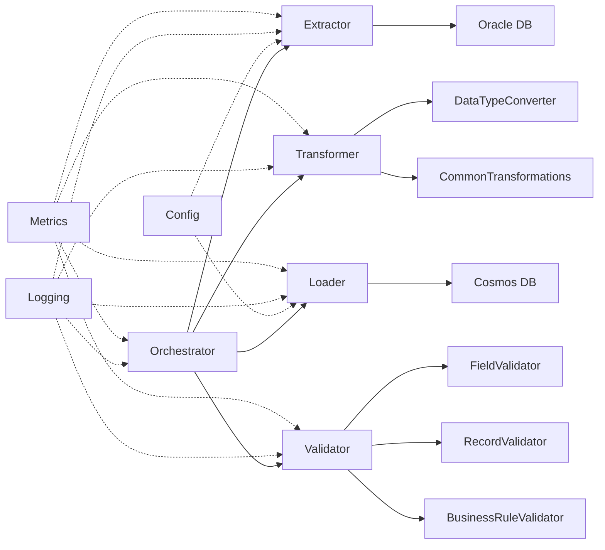

# Developer Guide

Comprehensive guide for developers working with the PySpark migration framework.

## Table of Contents

1. [Architecture Overview](#architecture-overview)
2. [Core Concepts](#core-concepts)
3. [Extending the Framework](#extending-the-framework)
4. [Code Organization](#code-organization)
5. [Best Practices](#best-practices)
6. [Troubleshooting](#troubleshooting)

## Architecture Overview

### Layered Architecture

The framework follows a layered architecture with clear separation of concerns:

```
┌─────────────────────────────────────────────┐
│         Orchestration Layer                 │
│  (migrate_reference_data.py,               │
│   migrate_employees.py,                    │
│   run_all_migrations.py)                   │
└─────────────────────────────────────────────┘
                    ↓
┌─────────────────────────────────────────────┐
│         Processing Layer                    │
│  ┌──────────┐ ┌──────────┐ ┌──────────┐   │
│  │Extractor │→│Transformer│→│Validator │   │
│  └──────────┘ └──────────┘ └──────────┘   │
└─────────────────────────────────────────────┘
                    ↓
┌─────────────────────────────────────────────┐
│         Data Layer                          │
│  ┌──────────┐              ┌──────────┐    │
│  │ Oracle   │──────────────→│ Cosmos   │    │
│  │   DB     │  (via Loader) │   DB     │    │
│  └──────────┘              └──────────┘    │
└─────────────────────────────────────────────┘
                    ↓
┌─────────────────────────────────────────────┐
│         Foundation Layer                    │
│  (Config, Utils, Logging, Metrics)         │
└─────────────────────────────────────────────┘
```

### Component Interactions



## Core Concepts

### Template Method Pattern

All base classes use the Template Method pattern:

```python
class BaseTransformer(ABC):
    """Base class for transformers."""
    
    def transform_with_metrics(self, *args, **kwargs):
        """Template method with metrics tracking."""
        self.metrics.start()
        
        try:
            # Validate inputs
            self.validate_input(*args, **kwargs)
            
            # Perform transformation (implemented by subclass)
            result = self.transform(*args, **kwargs)
            
            # Track success
            self.metrics.increment("records_transformed", result.count())
            self.metrics.record_success()
            
            return result
            
        except Exception as e:
            self.metrics.record_error(str(e))
            raise
    
    @abstractmethod
    def transform(self, *args, **kwargs) -> DataFrame:
        """Implement transformation logic (override in subclass)."""
        pass
```

**Benefits:**
- Automatic metrics collection
- Consistent error handling
- Logging at every step
- Reduces boilerplate code

### Configuration Management

Configuration uses a layered approach:

1. **Default values** in class definitions
2. **Environment variables** from `.env`
3. **Constructor parameters** for runtime override

```python
class OracleConnectionConfig:
    def __init__(
        self,
        host: str = None,
        port: int = None,
        service_name: str = None
    ):
        # Priority: Constructor > Env Var > Default
        self.host = host or os.getenv("ORACLE_HOST", "localhost")
        self.port = port or int(os.getenv("ORACLE_PORT", 1521))
        self.service_name = service_name or os.getenv("ORACLE_SERVICE_NAME")
```

### Data Flow

**Standard Migration Flow:**

1. **Extract** - Pull data from Oracle using JDBC
2. **Convert** - Transform Oracle types to JSON-compatible types
3. **Transform** - Denormalize and enrich data
4. **Validate** - Run 3-tier validation (Field → Record → Business)
5. **Load** - Write to Cosmos DB with retry logic

```python
# Example: Reference data migration
df = extractor.extract_regions()           # 1. Extract
df = DataTypeConverter.convert_dataframe(df)  # 2. Convert
df = CommonTransformations.create_reference_document(
    df, "region", "region_id", "ref_data", ["region_name"]
)  # 3. Transform
result = validator.validate_with_metrics(df)  # 4. Validate
loader.load(df)  # 5. Load
```

## Extending the Framework

### Adding a New Extractor

To extract from a different source (e.g., PostgreSQL):

```python
from extractors.base_extractor import BaseExtractor
from pyspark.sql import DataFrame

class PostgreSQLExtractor(BaseExtractor):
    """Extract data from PostgreSQL database."""
    
    def __init__(self, config: PostgreSQLConfig):
        super().__init__(
            name="postgresql_extractor",
            config=config
        )
        self.jdbc_url = self._build_jdbc_url()
    
    def _build_jdbc_url(self) -> str:
        """Build PostgreSQL JDBC URL."""
        return (
            f"jdbc:postgresql://{self.config.host}:{self.config.port}/"
            f"{self.config.database}"
        )
    
    def validate_source_connection(self):
        """Test PostgreSQL connection."""
        try:
            df = self.spark.read \
                .format("jdbc") \
                .option("url", self.jdbc_url) \
                .option("dbtable", "(SELECT 1) AS test") \
                .option("user", self.config.user) \
                .option("password", self.config.password) \
                .option("driver", "org.postgresql.Driver") \
                .load()
            
            df.count()
            self.logger.info("PostgreSQL connection validated")
            
        except Exception as e:
            raise ConnectionError(f"PostgreSQL connection failed: {e}")
    
    def extract(self, table: str, query: str = None) -> DataFrame:
        """Extract table or query from PostgreSQL."""
        dbtable = f"({query}) AS subquery" if query else table
        
        return self.spark.read \
            .format("jdbc") \
            .option("url", self.jdbc_url) \
            .option("dbtable", dbtable) \
            .option("user", self.config.user) \
            .option("password", self.config.password) \
            .option("driver", "org.postgresql.Driver") \
            .option("fetchsize", self.config.fetch_size) \
            .load()
```

### Adding a New Transformer

To implement custom transformation logic:

```python
from transformers.base_transformer import BaseTransformer
from pyspark.sql import DataFrame
from pyspark.sql.functions import col, when, concat_ws

class CustomerTransformer(BaseTransformer):
    """Transform customer data with custom logic."""
    
    def __init__(self):
        super().__init__(name="customer_transformer")
    
    def validate_input(self, df: DataFrame):
        """Validate input DataFrame."""
        required_cols = ["customer_id", "first_name", "last_name", "email"]
        
        for col_name in required_cols:
            if col_name not in df.columns:
                raise ValueError(f"Missing required column: {col_name}")
    
    def transform(self, customers_df: DataFrame, orders_df: DataFrame) -> DataFrame:
        """
        Transform customer data with order aggregations.
        
        Args:
            customers_df: Customer DataFrame
            orders_df: Orders DataFrame
            
        Returns:
            Transformed DataFrame with enriched customer data
        """
        # 1. Create full name
        enriched = customers_df.withColumn(
            "full_name",
            concat_ws(" ", col("first_name"), col("last_name"))
        )
        
        # 2. Aggregate order statistics
        order_stats = orders_df.groupBy("customer_id").agg(
            count("order_id").alias("total_orders"),
            sum("order_total").alias("lifetime_value"),
            max("order_date").alias("last_order_date")
        )
        
        # 3. Join with orders
        enriched = enriched.join(
            order_stats,
            on="customer_id",
            how="left"
        )
        
        # 4. Add customer segment
        enriched = enriched.withColumn(
            "segment",
            when(col("lifetime_value") > 10000, "VIP")
            .when(col("lifetime_value") > 5000, "Premium")
            .when(col("lifetime_value") > 1000, "Standard")
            .otherwise("Basic")
        )
        
        # 5. Add partition key
        enriched = CommonTransformations.calculate_partition_key(
            enriched,
            "segment_{segment}_{customer_id % 100}"
        )
        
        # 6. Add document ID
        enriched = CommonTransformations.add_document_id(
            enriched,
            "customer_{customer_id}"
        )
        
        # 7. Add metadata
        enriched = CommonTransformations.add_metadata(
            enriched,
            source_system="crm",
            entity_type="customer"
        )
        
        return enriched
```

### Adding a New Validator

To implement custom validation rules:

```python
from validators.base_validator import BaseValidator, ValidationResult
from pyspark.sql import DataFrame
from pyspark.sql.functions import col

class CustomerValidator(BaseValidator):
    """Validate customer-specific business rules."""
    
    def __init__(self):
        super().__init__(name="customer_validator")
    
    def validate(self, df: DataFrame) -> ValidationResult:
        """
        Validate customer data.
        
        Args:
            df: Customer DataFrame
            
        Returns:
            ValidationResult with errors
        """
        errors = []
        total_records = df.count()
        
        # Rule 1: VIP customers must have phone number
        vip_no_phone = df.filter(
            (col("segment") == "VIP") &
            (col("phone").isNull())
        ).count()
        
        if vip_no_phone > 0:
            errors.append({
                "type": "business_rule",
                "rule": "vip_phone_required",
                "error_count": vip_no_phone,
                "message": f"{vip_no_phone} VIP customers missing phone number"
            })
        
        # Rule 2: Customer age must be >= 18
        underage = df.filter(col("age") < 18).count()
        
        if underage > 0:
            errors.append({
                "type": "business_rule",
                "rule": "minimum_age",
                "error_count": underage,
                "message": f"{underage} customers under minimum age"
            })
        
        # Rule 3: Lifetime value should match order totals
        # (if orders are provided in context)
        # Add similar validation...
        
        is_valid = len(errors) == 0
        valid_records = total_records if is_valid else total_records - sum(e["error_count"] for e in errors)
        
        return ValidationResult(
            is_valid=is_valid,
            total_records=total_records,
            valid_records=valid_records,
            invalid_records=total_records - valid_records,
            errors=errors,
            warnings=[]
        )
```

### Adding a New Loader

To load to a different target system:

```python
from loaders.base_loader import BaseLoader
from pyspark.sql import DataFrame

class MongoDBLoader(BaseLoader):
    """Load data to MongoDB."""
    
    def __init__(self, config: MongoDBConfig, collection: str):
        super().__init__(
            name="mongodb_loader",
            config=config,
            batch_size=1000
        )
        self.collection = collection
        self.connection_uri = self._build_uri()
    
    def _build_uri(self) -> str:
        """Build MongoDB connection URI."""
        return (
            f"mongodb+srv://{self.config.user}:{self.config.password}"
            f"@{self.config.host}/{self.config.database}"
        )
    
    def validate_target_connection(self):
        """Test MongoDB connection."""
        try:
            # Try reading from collection
            df = self.spark.read \
                .format("mongodb") \
                .option("connection.uri", self.connection_uri) \
                .option("database", self.config.database) \
                .option("collection", self.collection) \
                .load()
            
            df.limit(1).count()
            self.logger.info("MongoDB connection validated")
            
        except Exception as e:
            raise ConnectionError(f"MongoDB connection failed: {e}")
    
    def prepare_data(self, df: DataFrame) -> DataFrame:
        """
        Prepare data for MongoDB.
        
        MongoDB automatically creates _id if not provided.
        """
        # Optionally add _id field
        if "id" in df.columns and "_id" not in df.columns:
            df = df.withColumnRenamed("id", "_id")
        
        return df
    
    def load_batch(self, batch_df: DataFrame, batch_number: int):
        """Load a single batch to MongoDB."""
        self.logger.info(
            f"Loading batch {batch_number}",
            records=batch_df.count()
        )
        
        batch_df.write \
            .format("mongodb") \
            .option("connection.uri", self.connection_uri) \
            .option("database", self.config.database) \
            .option("collection", self.collection) \
            .option("replaceDocument", "false") \
            .mode("append") \
            .save()
        
        self.logger.info(f"Batch {batch_number} loaded successfully")
```

## Code Organization

### Directory Structure

```
pyspark-migration/
├── config/              # Configuration management
│   ├── connections.py   # Database connection configs
│   ├── schema_definitions.py  # Schema definitions
│   └── transformation_config.py  # Transformation rules
├── extractors/          # Data extraction layer
│   ├── base_extractor.py
│   └── oracle_extractor.py
├── transformers/        # Data transformation layer
│   ├── base_transformer.py
│   ├── data_type_converter.py
│   ├── common_transformations.py
│   └── employee_transformer.py
├── validators/          # Data validation layer
│   ├── base_validator.py
│   ├── field_validator.py
│   ├── record_validator.py
│   └── business_rule_validator.py
├── loaders/             # Data loading layer
│   ├── base_loader.py
│   └── cosmos_loader.py
├── orchestration/       # Migration orchestration
│   ├── migrate_reference_data.py
│   ├── migrate_employees.py
│   └── run_all_migrations.py
├── utils/               # Utility modules
│   ├── logging_config.py
│   ├── error_handler.py
│   ├── spark_session.py
│   └── metrics.py
├── tests/               # Unit and integration tests
│   ├── test_transformers.py
│   └── test_validators.py
└── docs/                # Documentation
    ├── setup-guide.md
    ├── developer-guide.md
    └── deployment-guide.md
```

### Module Dependencies

```python
# Level 1: Foundation (no dependencies)
utils/
config/

# Level 2: Base classes (depend on utils/config)
extractors/base_extractor.py
transformers/base_transformer.py
validators/base_validator.py
loaders/base_loader.py

# Level 3: Concrete implementations (depend on base classes)
extractors/oracle_extractor.py
transformers/employee_transformer.py
validators/field_validator.py
loaders/cosmos_loader.py

# Level 4: Orchestration (depend on all above)
orchestration/migrate_reference_data.py
orchestration/migrate_employees.py
orchestration/run_all_migrations.py
```

## Best Practices

### 1. Use Structured Logging

Always use structured logging with context:

```python
self.logger.info(
    "Processing batch",
    batch_number=batch_num,
    records=df.count(),
    operation="transform"
)
```

**Don't:**
```python
print(f"Processing batch {batch_num}")  # Bad: no context, not logged
```

### 2. Leverage Metrics

Track important operations:

```python
def transform(self, df: DataFrame) -> DataFrame:
    self.metrics.start()
    
    result = self._perform_transformation(df)
    
    self.metrics.increment("records_transformed", result.count())
    self.metrics.record_timing("transformation_time", elapsed)
    
    return result
```

### 3. Handle Errors Gracefully

Use custom exceptions for different error types:

```python
try:
    df = self.extract_table("employees")
except JDBCConnectionError as e:
    self.logger.error("Database connection failed", error=str(e))
    raise
except DataExtractionError as e:
    self.logger.error("Data extraction failed", error=str(e))
    # Maybe retry or skip?
    raise
```

### 4. Cache Expensive Operations

```python
# Cache reference data used multiple times
departments_df = extractor.extract_departments().cache()
jobs_df = extractor.extract_jobs().cache()

# Use in multiple transformations
enriched1 = transformer1.transform(df1, departments_df, jobs_df)
enriched2 = transformer2.transform(df2, departments_df, jobs_df)

# Unpersist when done
departments_df.unpersist()
jobs_df.unpersist()
```

### 5. Write Testable Code

Keep methods focused and testable:

```python
# Good: Focused, testable methods
class MyTransformer:
    def transform(self, df: DataFrame) -> DataFrame:
        df = self._add_full_name(df)
        df = self._calculate_age(df)
        df = self._enrich_location(df)
        return df
    
    def _add_full_name(self, df: DataFrame) -> DataFrame:
        """Add full_name column (easy to test)."""
        return df.withColumn("full_name", concat_ws(" ", "first_name", "last_name"))
```

### 6. Document Complex Logic

```python
def _denormalize_employee_data(
    self,
    employees_df: DataFrame,
    departments_df: DataFrame,
    jobs_df: DataFrame
) -> DataFrame:
    """
    Denormalize employee data with 6-way joins.
    
    Join sequence:
    1. employees → departments (LEFT)
    2. employees → jobs (LEFT)
    3. departments → locations (LEFT)
    4. locations → countries (LEFT)
    5. countries → regions (LEFT)
    
    Uses LEFT joins to preserve all employees even if related data is missing.
    
    Returns:
        DataFrame with nested department/job/location/country/region objects
    """
    # Implementation...
```

## Troubleshooting

### Common Issues

#### 1. Spark Memory Errors

**Symptom:** `java.lang.OutOfMemoryError`

**Solutions:**
- Increase driver memory: `SPARK_DRIVER_MEMORY=8g`
- Process smaller batches: Reduce `batch_size` parameter
- Use `repartition()` to distribute data: `df.repartition(10)`

#### 2. JDBC Connection Timeouts

**Symptom:** `Connection timeout`

**Solutions:**
- Increase fetch size: `option("fetchsize", 10000)`
- Use partitioned reads: `option("partitionColumn", "employee_id")`
- Check network connectivity and firewalls

#### 3. Cosmos DB Throttling

**Symptom:** `429 - Request rate is large`

**Solutions:**
- Increase provisioned RUs
- Reduce batch size
- Framework automatically retries with exponential backoff

### Debugging Tips

**Enable verbose logging:**
```python
import logging
logging.getLogger("pyspark").setLevel(logging.DEBUG)
```

**Print DataFrame schemas:**
```python
df.printSchema()
df.show(5, truncate=False)
```

**Check execution plan:**
```python
df.explain(extended=True)
```

## Additional Resources

- [PySpark SQL Functions](https://spark.apache.org/docs/latest/api/python/reference/pyspark.sql/functions.html)
- [PySpark DataFrame API](https://spark.apache.org/docs/latest/api/python/reference/pyspark.sql/dataframe.html)
- [Azure Cosmos DB Best Practices](https://docs.microsoft.com/en-us/azure/cosmos-db/sql/best-practice-dotnet)
